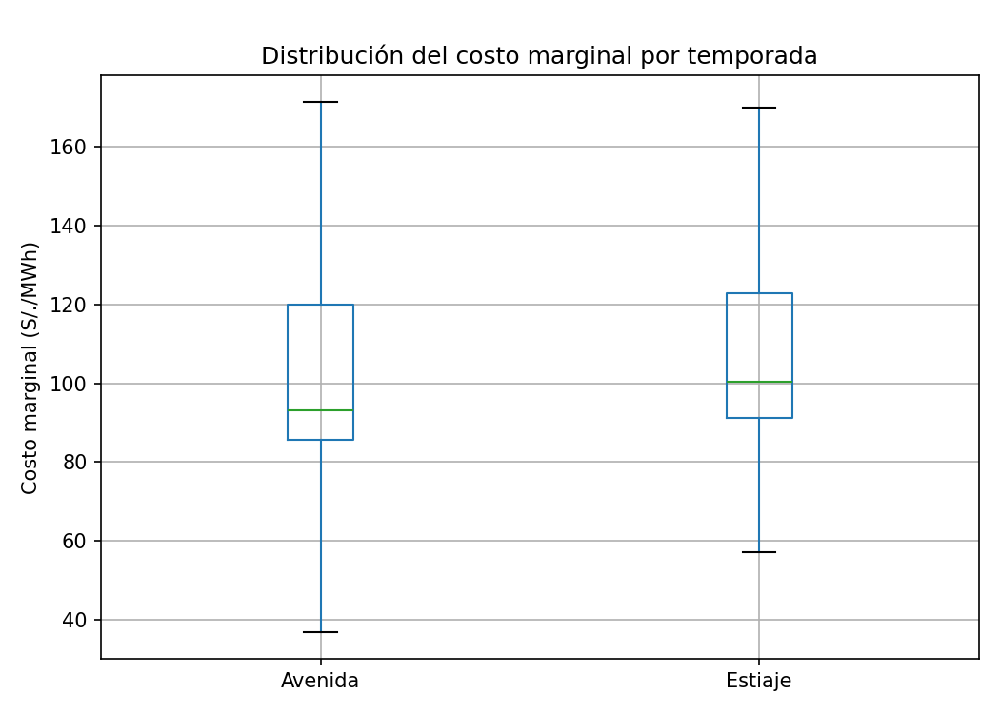
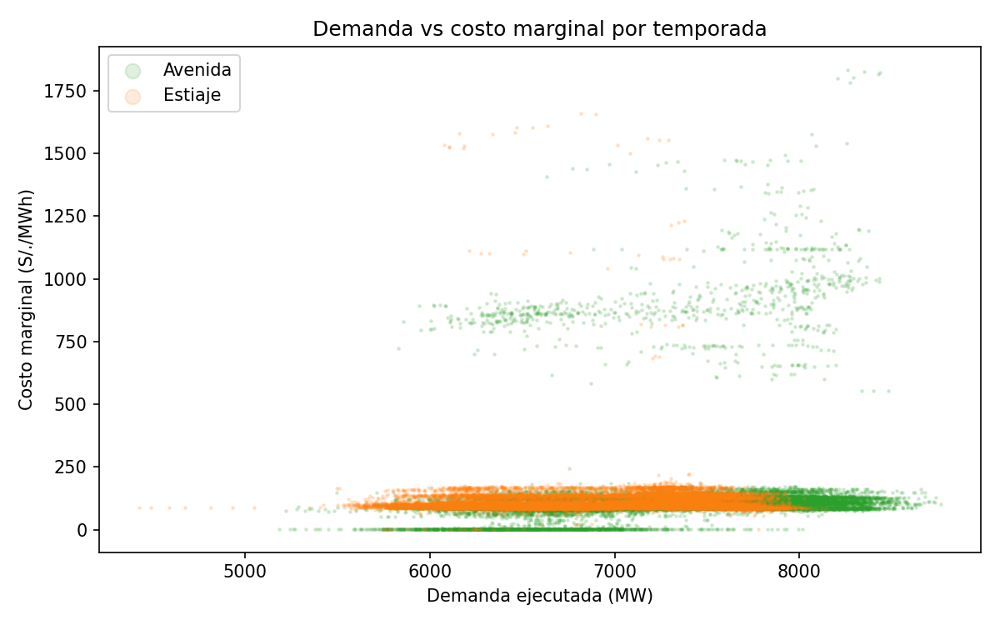

# Costos marginales del SEIN: avenida vs. estiaje

Análisis de los costos marginales de energía del Sistema Eléctrico
Interconectado Nacional (SEIN) del Perú, usando datos públicos del COES.

## Pregunta de investigación
¿Cómo varían los costos marginales del SEIN entre la temporada de avenida
y la de estiaje, y qué tanto influye la demanda?

## Contexto
El Perú depende en buena parte de la generación hidroeléctrica. En avenida
(aprox. diciembre a mayo) hay más agua disponible y la generación es más
barata; en estiaje (aprox. junio a noviembre) entra más generación térmica,
lo que eleva los costos marginales. Este proyecto cuantifica ese efecto.

## Datos
- **Fuente:** COES SINAC, portal web (coes.org.pe), sección Transferencias > Costos Marginales y Portal de Información > Demanda
- **Variables:** costo marginal de corto plazo (S/./MWh) y demanda ejecutada del SEIN (MW)
- **Resolución:** intervalos de 15 minutos
- **Periodo analizado:** junio 2024 – mayo 2026 (dos años hidrológicos)
- **Barra de referencia:** Santa Rosa 220 kV
- **Nota:** el COES publica el costo marginal en S/./kWh; se convirtió a S/./MWh multiplicando por 1000.

## Metodología
1. Descarga y limpieza de datos con pandas
2. Clasificación de cada registro por temporada (avenida / estiaje)
3. Estadística descriptiva por temporada y por mes
4. Análisis de correlación entre demanda y costo marginal
5. Visualización de resultados

## Herramientas
Python (pandas, NumPy, matplotlib), Jupyter Notebook

## Resultados


**1. El estiaje es más caro, pero menos de lo esperado.**
Excluyendo la crisis de Camisea, el costo marginal promedio fue de 110.5 S/./MWh en estiaje frente a 99.8 S/./MWh en avenida, una diferencia de 10.7 % (8 % en la mediana: 100.4 vs. 93.0).



*El diagrama de cajas omite valores extremos para comparar el comportamiento típico de cada temporada.*

**2. La demanda influye poco; pesa más la hidrología.**
La correlación entre demanda y costo marginal es débil en avenida (0.24) y prácticamente nula en estiaje (0.03). Además, la demanda es mayor en avenida (verano), y aun así el costo marginal es menor. Esto sugiere que la disponibilidad de agua para generación hidroeléctrica pesa más que el nivel de demanda.

**3. La avenida concentra los precios casi nulos.**
Se registraron 1,310 intervalos de 30 minutos con costo marginal menor a 5 S/./MWh en avenida (≈7.5 % del tiempo), frente a solo 22 en estiaje, consistente con periodos de excedente hidráulico.



**4. Los precios extremos vienen de choques de oferta, no de la demanda.**
Durante la emergencia por la ruptura del gasoducto de Camisea (1–21 de marzo de 2026), el costo marginal promedió 605.9 S/./MWh, unas 6 veces el promedio normal de avenida, al reemplazarse gas natural por combustibles líquidos. ([referencia](https://es.wikipedia.org/wiki/Crisis_energ%C3%A9tica_de_Per%C3%BA_de_2026))

## Conclusión
La estacionalidad hidrológica explica una diferencia moderada en el costo marginal, mientras que la demanda tiene un efecto débil. Los mayores riesgos de precio provienen de eventos de oferta, como la indisponibilidad de gas natural.

## Limitaciones y próximos pasos
- Se analizó una sola barra (Santa Rosa 220 kV).
- La correlación no implica causalidad; falta incorporar datos de hidrología y despacho por tecnología.
- Próximo paso: analizar el perfil horario (punta vs. fuera de punta) y añadir caudales/volúmenes de embalses del COES.
## Estructura del repositorio
- `data/` – datos descargados del COES
- `notebooks/` – análisis paso a paso
- `src/` – funciones de limpieza y procesamiento
- `images/` – gráficos usados en este README

## Cómo ejecutarlo
```
pip install -r requirements.txt
jupyter notebook
```

## Autor
Jhon Milton Peralta Diaz – Bachiller en Ingeniería Eléctrica (UNMSM)
[LinkedIn](https://linkedin.com/in/jhonmiltonpedz)
