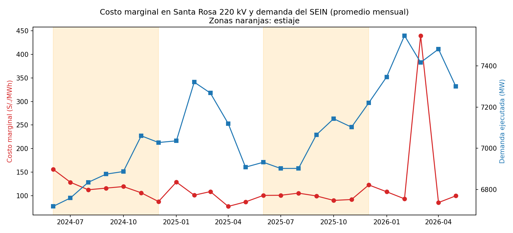

# Costos marginales del SEIN: avenida vs. estiaje

Análisis de los costos marginales de energía del Sistema Eléctrico
Interconectado Nacional (SEIN) del Perú, usando datos públicos del COES.

## Pregunta de investigación
¿Cómo varían los costos marginales del SEIN entre la temporada de avenida
y la de estiaje, y qué tanto influye la demanda?

## Contexto
El Perú depende en buena parte de la generación hidroeléctrica. En avenida
(aprox. diciembre a mayo) hay más agua disponible y la generación es más
barata; en estiaje (aprox. junio a noviembre) entra más generación térmica,
lo que eleva los costos marginales. Este proyecto cuantifica ese efecto.

## Datos
- **Fuente:** COES SINAC, portal web (coes.org.pe), sección Transferencias > Costos Marginales y Portal de Información > Demanda
- **Variables:** costo marginal de corto plazo (S/./MWh) y demanda ejecutada del SEIN (MW)
- **Resolución:** intervalos de 15 minutos
- **Periodo analizado:** junio 2024 – mayo 2026 (dos años hidrológicos)
- **Barra de referencia:** Santa Rosa 220 kV
- **Nota:** el COES publica el costo marginal en S/./kWh; se convirtió a S/./MWh multiplicando por 1000.

## Metodología
1. Descarga y limpieza de datos con pandas
2. Clasificación de cada registro por temporada (avenida / estiaje)
3. Estadística descriptiva por temporada y por mes
4. Análisis de correlación entre demanda y costo marginal
5. Visualización de resultados

## Herramientas
Python (pandas, NumPy, matplotlib), Jupyter Notebook

## Resultados


- [Hallazgo 1]
- [Hallazgo 2]
- [Hallazgo 3]

## Estructura del repositorio
- `data/` – datos descargados del COES
- `notebooks/` – análisis paso a paso
- `src/` – funciones de limpieza y procesamiento
- `images/` – gráficos usados en este README

## Cómo ejecutarlo
```
pip install -r requirements.txt
jupyter notebook
```

## Autor
Jhon Milton Peralta Diaz – Bachiller en Ingeniería Eléctrica (UNMSM)
[LinkedIn](https://linkedin.com/in/jhonmiltonpedz)
